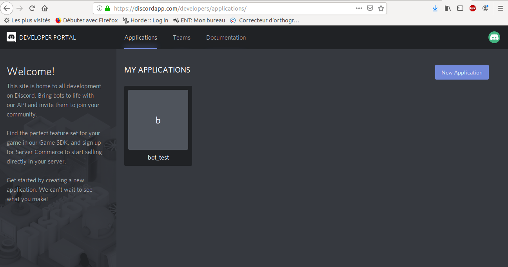
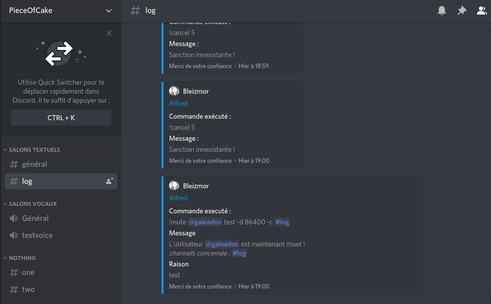
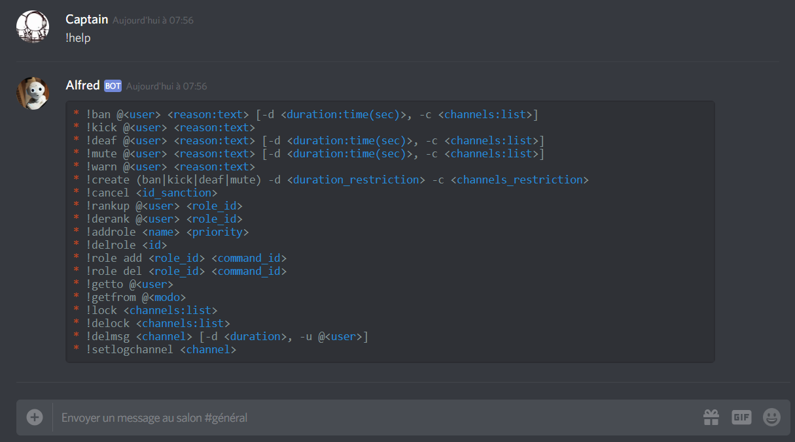
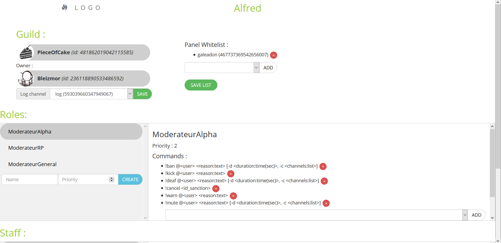
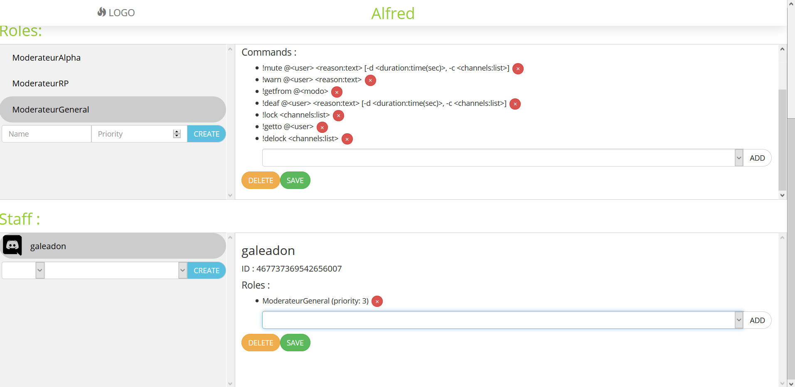

# Rapport de fin de projet Web et BDD
## Alfred - 'Bot de modération Discord'
___


Dans le cadre de notre projet web, nous cherchons à mettre en place un bot sur l'application de chat en ligne __discord__,
le but étant de mettre en place un bot pouvant réaliser les tâches suivantes :
> - Gérer la modération en permettant au bot de créer ou supprimer des modérateurs sur le serveur Discord
> - Gérer les sanctions en permettant au bot de punir des utilisateurs en recevant une commande d'un modérateur
> - Détecter les comportements illicites tels que le spamming et le punir en conséquence sans passer par le biais d'un modérateur.

En prime, nous mettrons en place une interface web permettant de gérer le bot sur un site à part,
ce site web disposera des fonctionnalités suivantes :
> - Permettre la diffusion publique du bot
> - Chaque utilisateur ayant le bot installé sur son serveur doit avoir accès à un panel
> d’administration. Ce panel d’administration doit permettre d’activer/désactiver ou/et de configurer
> certaines fonctionnalités du bot.

Notre mission doit donc nous amener à comprendre le fonctionnement d'un serveur node js, et établir un lien entre notre application et un élément extérieur.

Au travers de ce rapport nous verrons la manière dont nous avons réalisé ces tâches, en commencant par l'élaboration d'un serveur node js utilisant des websocket afin de communiquer avec l'API discord, puis la réalisation du bot avec Discord.js et enfin la réalisation de notre panel de gestion du bot.


Pour toutes questions en ce qui la base de données, vous pouvez vous référer à notre précédent rapport  __`rapport_conception_db.md`__ (Attention, la base de données a légèrement été modifiée depuis).


## Création d'un bot Discord

La première partie de notre travail de création d'un bot Discord est évidemment de déclarer le bot. Pour ce faire nous nous renderons sur le portail Developers de discord à l'adresse : __'https://discordapp.com/developers/applications/'__


On crée une application qui deviendra notre futur bot. Discord nous fournit ce portail afin de simplifier la création d'application sur leur plateforme et afin de répertorier les bots créé par la communauté.

On se rend ensuite dans l'onglet **"Bot"** afin de confirmer que notre application est un utilisateur robot, une fois que l'on confirme la nature de notre application nous serons données par Discord un __`Token`__ qui sera utilisé par notre application node js afin de s'identifier sur discord.


## Mise en place du WebSocket

Afin de comprendre le principe derrière la discussion entre node js et Discord. Nous avons commencé par mettre en place un webSocket qui nous permet d'établir une connection persistante avec le l'api discord. Ensuite, il suffit de s'identifier avec le __token__ unique et d'envoyer un signal tous les X temps afin d'annoncer que le bot est toujours en fonctionnement. Par manque de temps, nous avons simplement créer un micro-bot qui répond "Pong" lorsqu'un message "ping" est envoyé depuis un serveur discord.

L'intérêt de cette partie est double, comprendre le fonctionnement des websockets car c'est quelque chose que nous n'avions jamais manipulé, et comprendre le fonctionnement de discord et de son API.

La solution développer pour ce ping-pong se trouve dans le dossier `./src/pingpong` et comprend deux fichiers, un pour la communication avec l'api (utilisations du module `axios`) et l'autre pour la gestion évenementielle.

> Pour tester cette réalisation, il suffit d'utiliser la commande : `npm run pingpong` depuis un terminal.


### Fonctionnement des WebSockets

Le but des WebSockets est de mettre en place une liaison entre l'api Discord et notre fichier serveur javascript (ici notre bot). Pour ce faire nous commençons par déclarer un objet webSocket `client`, ce qui nous permet d'initialiser la connection par le protocol `wss`. Puis il suffit de déclarer les fonctions à appelé lors de la réception d'un certain évennement.


### Discord.js


Discord.js est la principale bibliothèque que nous avons employée durant la réalisation de notre application, il s'agit d'une application couramment utiliser afin de réaliser des bots sur Discord et permettant de simplifier la discussion entre notre code Javascript et Discord. 

Discord.js s'articule autour d'événement, cela signifie que si certaine action sont détectés dans l'application Discord, alors le programme réagira. Nous présenterons ici deux des principaux événements de Discord.js :

**`Ready`** 

``` JS
const Discord = require('discord.js');
const client = new Discord.Client();
client.on('ready', () =>{/* Instructions */});
```
Premier événement lancé quand le bot démarre et se connecte à un serveur, on lui donne des configurations au démarrage tel que l'antispam dans cet événement.

**`Message`** :

``` JS
const Discord = require('discord.js');
const client = new Discord.Client();
client.on('message', msg => {/* Instructions */});
```
Événement lancé quand le bot détecte qu'un message a été posé sur le chat, **n'importe quel message**, cette commande est central à notre application car elle est celle qui nous permet de traiter presque toutes les commandes, mais aussi l'anti-spam et l'anti-insulte.

Il est très important quand on utilise `message` de faire attention à ne pas signaler ou discuter avec un autre bot afin d'éviter les risques potentiels de boucle infini de discussion entre deux bots. Ainsi, `message` commence souvent par une condition afin de vérifier si celui qui a posté le message est bien humain :

``` JS
if (msg.author.bot) return;
```

Puis nous procédons à la vérification s'il ne s'agit pas d'un spam, d'une insulte et enfin d'une commande.

Il existe beaucoup de types différents de gestion d'événement, certain que nous créons, d'autres déjà existant dans Discord.js que nous utilisons.

Bien sûr, hormis les événements, Discord.js propose de nombreux autres avantages tels que l'écriture simplifiée dans le chat, ou une gestion plus facile des rôles. Tous ces avantages le rendent bien plus utile à employer que le Websocket que nous employons jusque-là, ce qui fût notre principale raison pour privilégier cette bibliothèque.


Bien évidemment, Discord.js n'est pas sans défaut, et le principal d'entre eux est la manière dont le code permettant la discussion entre Javascript et Discord est "caché".
Discord.js ne permet pas de comprendre les mécanismes en arrière-plan qui forme le lien JS et Discord et dès lors, nous sommes privés d'une partie de notre capacité à modifier ce dernier dans le cadre de l'utilisation de Discord.js.

C'est cette raison qui nous a poussé au début du projet à concevoir un ping-pong en Websocket : comprendre le mécanisme de discussion entre Discord et node js.


### Commandes

// TODO gestion (rappel sur les commandes globals), la possibilité de créer des commandes, l'utilisation de regex, (et la création dynamic de regex), generiquen ...

Nous nous sommes très vite rendu compte que pour effectuer les commandes de manière optimisée dans leurs traitements, il était nécessaire de créer des fichiers personalisés pour chaque commande globale. Les commandes globales traitent un problème de manière précise et unique en fonction de la commande global traité par un **regex**.

> Voici la liste des commandes globales et leurs fichiers de traitement :

* Bannir un utilisateur :\
`ban.js`
* Exclure un utilisateur :\
`kick.js`
* Rendre sourd un utilisateur :\
`deaf.js`
* Rendre muet un utilisateur :\
`mute.js`
* Avertir un utilisateur :\
`warn.js`
* Déclarer un channel comme channel de logs pour le bot :\
`setlogchannel.js`
* Annuler une sanction par son id :\
`cancel.js`
* Ajouter un role de moderation à un utilisateur :\
`rankup.js`
* Retirer un role de moderation à un utilisateur :\
`delrank.js`
* Ajouter un rôle (le créer) :\
`addrole.js`
* Supprimer un rôle :\
`delrole.js`
* Ajouter une commande à un rôle :\
`role_add.js`
* Retirer une commande à un rôle :\
`role_del.js`
* Récupérer les sanctions appliquées à un utilisateur :\
`getto.js`
* Récupérer les sanctions appliquées par un modérateur :\
`getfrom.js`
* Verouiller un ou des channels :\
`lock.js`
* Déverouiller un ou des channels :\
`delock.js`
* Supprimer les messages d'un channels (message d'un joueur et/ou depuis x sec) :\
`delmsg.js`
* Obtenir la liste des commandes sur le serveur :\
`help.js`


>   *Description de `lock.js` :*
>
>   lock.js fût le premier nécessitant la création d'un rôle afin de le faire fonctionner.
>
>   En effet, afin de verrouiller les channels, il est nécessaire de bloquer les utilisateurs en leur retirant les droits de lecture, écriture sur le channel, cependant cela ne pouvait pas être fait sur le rôle @everyone car cela aurait posé beaucoup plus de travail sur lock.js pour le mettre en place.
>
>   Au lieu de cela, nous avons créé un rôle lock, de priorité très forte et on le donne à tout le monde. Ainsi, ceux ayant ce rôle se voient incapables d'écrire/lire sur le channel. Bien sûr, l'administrateur et les modérateurs autorisés peuvent continuer à écrire/lire dessus.
>


>   *Description de `cancel.js` :*
>
>   cancel.js est un fichier nous permettant d'annuler une sanction d'après son id dans la base de données. Après avoir exécuté une commande dans la bdd pour vérifier l'existence de la sanction, cette dernière est effacée de la base et en fonction de son type on applique différents traitements permettant d'annuler les punitions appliquées.
>
>   Noter que cancel.js efface aussi la commande des logs, elle n'est plus retrouvable après.  
>


>   *Description de `setlogchannel.js` :*
>
>   Une commande particulière qui permet de transformer un channel en un channel de logs, cela signifie que le bot emploiera ce channel pour décrire toute les actions qu'il effectue.
>
>   Pour mettre en place ce channel, la commande accède à la base de données et à l'intérieur du serveur lui indique quel channel (donc l'id du channel) auquel il doit envoyer envoyer les logs du bot.
>
>   Si aucun channel de log n'est en place, alors le bot n'envoi aucun log.
>   
>

>   *Description de `help.js` :*
>
>   Une commande permettant de récupérer de la base de données l'ensemble des commandes présente sur le serveur.
> 
>

Cependant, afin de faire fonctionner ces commandes, nous avons dû trouver un moyen de faire comprendre au bot la différence entre les différentes commandes, et pour cela nous avons finis par trouver les **regex** ou expression régulière.

Les epxressions régulière sont des chaines de caractères de syntaxe précise, qui permettent notamment de pouvoir vérifier la validité d'une chaine de caractère qui peut contenir un nombre illimité de caractère, comme par exemple une commande de modération avec une raison. 

RegExp est un constructeur JavaScript permettant de reconnaitre une chaine de caractère afin d'en extraire des informations nécessaires au bon déroulement de la commande :

> *Exemple :*
>
> message.match( new RegExp('^!ping[ ]*$', 'i') ) )
>
>
> `message.match()` : Check si le message est correcte par rapport à la fonction en paramètre, il retourne vrai si l'expressino régulière est valide
>
> `RegExp()` : Check si le message correspond au string en paramètre en vérifiant son expression régulière
>
> `'^!ping[ ]*$'` : si le message correspond à ce pattern alors le regExp retourne vrai
>
> `'i'` : on indique que le message doit être converti en minuscule, sans majuscule


C'est à partir de ces expressions régulières que nous analysons dans 


#### Création dynamique de regex

Les commandes personnalisées sont des commandes de sanctions avec des atomes respectant certaines contraintes. Il y a donc deux contraintes personnalisable, la durée de la sanction et la liste des channels dans lesquels elle prend effet.

* Contrainte sur la durée : \
Elle est sous deux formes, soit inférieur, soit supérieur à la durée spécifier lors de la création de la commande. \
Exemple :
    1. La durée doit être inférieur à 60 secondes : `<60`
    2. La durée doit êter supérieur à 60 secondes : `>60`

* Contrainte sur les channels : \
Elle permet également deux choses, soit que la sanction prenne effet sur un channel spécifié dans la liste, soit elle ne doit pas être dans la liste. \
Exemple :
    1. Le ou les channel(s) dans lequel/lesquels la sanction prend effet doit appartenir à la liste des channels suivant : `IN <#1245641> <#75431545741> .audio`
    2. Le ou les channel(s) dans lequel/lesquels la sanction ne doit pas prendre effet doit appartenir à la liste des channels suivant : `NOT IN <#1245641> <#75431545741> .audio`

Afin d'assurer que ces contraintes soient reconnues, nous avons créé un algorithme permettant de créer des regex dynamiquement (`./src/utils/chan_list_regex_creation.js` pour les channels et `./src/utils/number_regex_creation.js` pour la durée). Ces regex assure donc que la commandes respecte les contraintes spécifiées, et le traitement de cette sanction se fait via les mêmes méthodes que pour les sanctions de base (ex: un ban sur les channels de la catégorie 'RP' sera traité de la même manière qu'un ban du serveur).

Par exemple :

    Si l'on créer une commande de ban qui doit avoir une durée inférieur à 1 jour et qui ne doit pas prendre effet sur un channel audio et sur les channels de la catégorie '#Salons textuels' :

> On execute la commande de création suivante : `!create ban -d <86400 -c NOT IN .audio <#481862020543545344>`

> Le 'schéma' de la commande est généré : `!ban @<user> <reason:text> [-d <duration: time(sec)<86400>, -c <channel: NOT IN .audio <#481862020543545344>>]`

> Et la regex suivante est également généré : `^!ban[ ]+<@!?([0-9]+)>[ ]+((?:(?!-d|-c).)+)(-d[ ]+(86400|86[0-3][0-9]{2}|8[0-5][0-9]{3}|[0-7][0-9]{4}|[0-9]{,4}))?([ ]*-c[ ]+(?:(?!\.audio[ ]*|<#481862020543545344>[ ]*)<#[0-9]+>[ ]*|\.text[ ]*)+)?[ ]*$`


### Anti-spam


Notre bot devait aussi pouvoir assurer une fonction de surveillant permanent de nos channels afin d'éviter la présence de spammeurs qui pourrait rendre le chat invivable en l'absence d'un modérateur humain.

Ainsi nous avons donné à notre bot la possibilité d'analyser par lui-même le contenu des messages à l'aide d'une fonction **`checkmessage`** qui vérifie en permanence, non seulement si un utilisateur envoie trop de message à la suite et ainsi cherche à flooder le chat dans un intervalle précis, mais aussi vérifie pour chaque message la présence d'insultes ou de mot grossier.

Une première offense vous donneras des warnings, cependant si l'utilisateur continu dans sa démarche, il sera banni.

>   **Anti-spam**
>
>   Le bot récupère le dernier message du channel, il le place dans une liste puis continue ainsi de suite avec chaque message qu'il reçoit. Si un même utilisateur a écrit plusieurs messages dans un intervalle de temps très court, il recevra un warning car il spam. S'il reçoit trop de warning, ou que son spam est trop important du premier coup, il sera banni.
>
>   Le nombre de warning toléré, l'intervalle de temps pour que le message soit considéré comme du spam et le nombre de messages nécessaires pour être considéré comme tel, peuvent tous être configuré.


>   **Anti-insulte**
>
>   Le bot récupère le dernier message du channel, puis il compare le contenu de ce message à une liste de mots grossiers et insulte. Si un mot grossier ou une insulte est détecté, il reçoit un warning. S'il recommence, il est banni.
>
>   Pour l'anti insulte, l'utilisateur n'a le droit qu'à un warning. S'il recommence, il est banni.


### Base de données


La base de données, issus de la première partie de notre projet, fût utilisée dans le cadre de notre application comme un pilier central auquel s'articule autour l'ensemble de notre application.

Par cela, il faut comprendre que chaque commande passe par notre base de données d'une manière ou d'une autre (ne serait-ce que pour vérifier la permission d'un utilisateur à l'exécution d'une commande), notre bot s'y réfère toujours en cas de questionnement, ou à l'application d'une sanction.

Pour utiliser la base de données dans notre bot d'administration, nous avons employé le SGBD **postgresql**, auquel nous accédons grâce au module node **pg**. Dans le dossier **`model`** nous avons mis dans le fichier **`index.js`** les composants permettant d'accéder à notre base de données.

Nous avons une constante qui enregistre les informations de connexions:

```JS
const { Pool } = require('pg');
const pool = new Pool({
    user: '<user_name>',
    host: '<host>',
    database: '<database>',
    password: '<password>',
    port: '<port>'
});
```
Et ensuite nous avons mis en place une fonction nous permettant d'exécuter des requêtes vers la base de données et retourner le résultat.

```JS
module.exports = {
    query: (text, params) => {
        return pool.connect()
        .then(client => {
            let start = Date.now();
            client.query('SET search_path TO bot_moderation;'); // use bot_moderation schema

            return client.query(text, params)
            .then(res => {
                client.release();
                let duration = Date.now() - start;
                console.log("executed query", {text, params, duration, rows: res.rowCount});
                return res;
            })
            .catch(err => {
                client.release();
                let duration = Date.now() - start;
                console.log("Fail to execute query", {text, params, duration, err});
                throw err;
            });
        });
    }
}
```

Cette fonction sera vital par la suite pour notre projet.


## Panel d'administration Web

Le panel est la troisième et dernière partie de notre projet. Nous devons mettre en place une interface afin de pouvoir administrer le bot depuis une page web.

Cette interface comporte une page d'accueil par lequel nous nous connectons à discord ainsi que d'un lien permettant d'appeler le bot sur votre serveur Discord.

> Page d'accueil de notre application web :


### Identification

// TODO utilisation de oauth2 avec l'api DISCORD (identifiants discords...) + whitelist en BDD
// peut accéder à plusieurs serveurs si on est dans la whiteliste de plusieurs serveurs par exemple...


### Panel

Le panel est retrouvable dans le dossier `./src/web` mais il utilise les fonctions déjà défini dans le dossier `./src/command` puisque tout ce qui est fait sur le panel peut etre fait en ligne de commande sur le serveur discord.

### Les données brut

Pour l'affichage de la page d'administration d'un serveur, les données sont envoyées dans un seul objet :

```JS
var guild = {
    id: 'snwoflake',
    name: 'string',
    icon: 'url',
    owner: {
        username: 'string',
        locale: 'string',
        mfa_enabled: false,
        flags: 0,
        avatar: 'url',
        discriminator: 'int',
        id: 'snowflake'
    },
    log_channel: '<snowflake:channel_id>',
    staff: {
        '<snowflake:user_id>': {
            id: '<snowflake:user_id>',
            username: 'string',
            avatar: 'url',
            roles: [Array<role:id>]
        }
    },
    roles: {
        '<int:id>':	{
            id: 1,
            name: 'ModerateurAlpha',
            priority: 2,
            commands: [Array<command:id>]
        }
    },
    commands: {
        '1': {
            id: 1,
            command: '<string:command_help>',
            regex: 'string'
        }
    },
    whitelist: [Array<user_id>],
    members: {
        '<snowflake:user_id>': {
            nick: 'string',
            user: [Object<Discord_api_user>],
            roles: [Array<Discord_guild_roles>],
            premium_since: null,
            deaf: false,
            mute: false,
            joined_at: 'timestamp'
        },
    },
    channels: {
        '<snowflake:channel_id>': {
            permission_overwrites: [Array],
            name: 'string',
            parent_id: null,
            nsfw: false,
            position: 0,
            guild_id: '<snowflake:guild_id>',
            type: 4,
            id: '<snowflake:channe_id>'
        },
    },
    owner_id: '<snowflake:user_id>'
}
```

Cet objet contient toutes les informations nécessaires à l'administration d'un serveur, et permet l'affichage et la modifications de ces informations très simplement.
C'est tout simplement l'ensemble des informations que nous avons sur une serveur et que nous avons complété avec l'API discord.


### L'affichage




### API

Afin de rendre les modifications via le panel plus souple, nous avons créé une partie API REST à notre panel. Cela permet tout simplement, comme le monter les screens ci-dessus, de modifier les données du serveur au fur et à mesure et sans attendre la fin d'une requete pour faire d'autres modifications. Notre interface est donc indépendante et réagit en fonctions des reponses de l'api.


### Front

Comme vue dans la partie précédente, la partie front (juste le panel) reste indépendante du serveur. Par manque de temps pour prendre en mains un nouvelle solution, nous avons développé cette partie en Vanilla JS. Nous avons donc créé un ensemble de fonction permettant de modifier l'interface sans intervention du serveur. Les requêtes vers l'API sont faites avec le module `axios`. Il s'agit d'un module qui permet de faire des requêtes API respectant les conventions REST.


## Conclusion

Au final, ce projet fût pour nous d'un grand intérêt, tant par l'ensemble des technologies que nous avons pu découvrir, que par le lien qu'il fait avec les technologies et problématiques modernes.

Nous avons pu concevoir une véritable application employant différentes formes de méthodes et technologies, grâce à notre travail sur la base de données nous avons mis en place une architecture que nous avons pu ensuite utiliser au sein de notre application.

L'emploi de **javascript** nous a aidé à mieux maitrisé ce langage, ainsi qu'à découvrir de nouvelle façon de l'utiliser, nous pouvons par exemple citer la fonction **regex**, ou bien la façon de réaliser l'architecture de notre programme afin de le rendre plus facile à comprendre, adapter ou corriger.

La création d'un bot Discord nous a aussi appris à nous adapter aux technologies en dehors de notre cadre de travail habituel. Devoir aller chercher l'information, résoudre les conflits avec l'api **Discord.js**, nous adapter dans notre démarche pour comprendre Discord, fût une expérience enrichissante.

Enfin la mise en place d'un panel web, nous a permis de comprendre comment les différentes applications sur le web travaillent et s'articule l'une autour de l'autre, en réalisant un projet comme celui-ci, nous avons pu comprendre le fonctionnement d'outil tel que **Node Js**.

Au final, ce projet fût un grand enrichissement personnel, et nous espérons pouvoir utiliser les connaissances que nous en avons tirées soit dans notre vie professionelle, soit à titre personnel.


_________________________________________________________________


## Conception du bot avec Discord.js


> Afin de faciliter la réalisation de notre bot, nous avons choisi d'utiliser la bibliothèque __discord.js__.

Grâce à l'outil discord.js, nous pouvons simplifier la mise en place du bot, à l'aide des différentes fonction déjà présentes dans l'extension. Cependant la simplification ouvre la porte à l'étendue du problème de la réalisation de l'application et afin de la simplifier, nous avons découpé l'application en plusieurs dossiers, chacun devant traités un aspect spécifique du bot :


### src/index.js


Le fichier en charge de traiter la connexion du bot au serveur, ainsi que la récupération des messages addressé au bot avant de les envoyer vers un index de traitement. Cela inclut notamment la détection de si le message est destiné au bot et vient d'un autre bot (dans ce cas il est ignoré) ou d'un utilisateur humain. Dans ce cas le message est envoyé dans la commande __`check_and_run()`__ de src/command.index.js afin de vérifier si le message vient d'un propriétaire légitime ou non.

Le fichier index.js est disponible dans /src/


### src/command/index.js


Le fichier index.js dans ./src/command/ à pour but de traiter les commandes envoyées par un utilisateur. Il commence d'abord par vérifier si l'utilisateur est légitime dans sa demande en vérifiant s'il dispose des droits nécessaires.

S'il dispose des droits nécessaires la commande est passée au travers d'un moulinage de **Regex** afin de comprendre de quelle commande il s'agit. Si la commande est trouvée, elle est immédiatement exécutée par l'appel d'une fonction **`callfunc()`** qui traitera la fonction reçue.

Si le match() ne retourne rien, alors il ne s'agit pas d'une fonction n'est pas traité.


<<<<<<< HEAD
Chacune de ces commandes est retrouvable au sein du dossier ***/command/*** et dispose de sa propre manière de traiter l'information reçu en paramètre. Elle retourne toujours un message en cas d'erreur. 


## Panel


Le panel est la troisième et dernière partie de notre projet. Nous devons mettre en place une interface afin de pouvoir administrer le bot depuis une page web.

Cette interface comporte une page d'accueil par lequel nous nous connectons à discord ainsi que d'un lien permettant d'appeler le bot sur votre serveur Discord.

Le panel est retrouvable dans le dossier /src/web et quand installé sur le serveur, présentes différentes pages :


### Accueil


### 
=======
Chacune de ces commandes est retrouvable au sein du dossier ***/command/*** et dispose de sa propre manière de traiter l'information reçu en paramètre. Elle retourne toujours un message en cas d'erreur.
>>>>>>> 3763af221c5935e8ec96986964ce0658a0eda9d1
