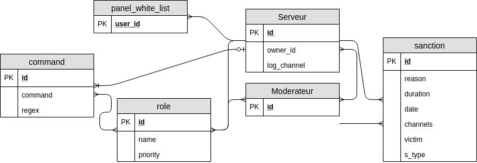

# Rapport sur la conception de la BDD pour le projet 'Bot de modération Discord'

> Pour des raisons de portabilitée, nous avons choisi d'utiliser le SGBD __SQLite__.

Nous avons tout d'abord analysé le cahier des charges afin de définir les données nécessaire à notre bot. \
Le bot peut être présent sur plusieurs serveur, il faut donc différencier ces serveurs, nous avons créé une table '__serveur__'. Nous avons choisi de ne sauvegarder que l'identifant de ce serveur et l'identifiant du propriétaire. \
Un serveur possède un staff, qui correspond à la table '__moderateur__', nous sauvegardons l'identifiant de cet utilisateur et son username. \
Un serveur possède une liste de sanction, la table '__sanction__', avec la raison, la durée, la date de saisie, la liste des channels (*voir partie __Syntaxe du paramètre `channels`__ de ce rapport*) où la sanction est effective, l'utilisateur concerné et la commande effectué par le modérateur. \
Le bot propose une liste de commande prédéfini (*voir partie __Listes des commandes globale__ de ce rapport*), il y a donc une table __command__. \
Il est possible de créer des commandes personnalisées sur un serveur, contrairement aux commandes 'globales', ces commandes sont liées à un serveur, la table '__custom_command__' correspond à cette demande. \
Enfin, il peut exister plusieurs rôles pour un staff sur un même serveur, ce rôle permet d'avoir accès à certaines commandes (globales ou lié à un serveur). Et un membre du staff (table '__moderateur__') peut avoir plusieurs rôle (table '__role__') avec une même commande. Nous avons alors rajouté un attribut '*priority*' dans la table '__role__' afin de créer un système de hiérarchie des rôle. Si un moderateur possède deux rôle avec un priority équivalente et deux commandes identique (sauf pour l'effet), le premier sera pris en compte. \
Pour finir, notre solution doit proposer un panel d'administration accessible depuis notre site web. Pour s'y connecter, nous utiliserons une WhiteList (table '__panel_white_list__') et le compte Discord de l'utilisateur. Cette WhiteList sera alimenté par le propriétaire du serveur en question.

## Schéma associatif de la base de données


## Dictionnaire de données
| table | champs | type | description |
|:-:|:-:|:-:|:--|
| __serveur__ | id | integer | identifiant d'un serveur |
|  | owner_id | integer | identifiant de proprietaire du serveur |
|  |  |  |  |
| __moderateur__ | uid | integer | identifiant du membre moderateur |
|  | username | varchar | nom du moderateur |
|  | lock_is_delete | boolean | lock qui defini si le moderateur appartient toujours au staff ou non |
|  |  |  |  |
| __command__ | id | integer | identifiant de la command |
|  | command | varchar | command et ses parametres, on se servira de regex pour l'identification des commandes par la suite |
|  |  |  |  |
| __role__ | id | integer | identifiant du role de moderateur (type) |
|  | name | varchar | nom de ce role |
|  | priority | integer | priorité du role (plus l'entier est petit, plus il sera considéré comme important) |
|  |  |  |  |
| __sanction__ | id | integer | identifiant de la sanction |
|  | user | integer | identifiant d'un utilisateur discord |
|  | date | datetime | date de la sanction |
|  | duration | datetime | dure de cette sanction (NULL s'il n'y a pas de duree) |
|  | reason | varchar | raison de la sanction |
|  | channels | varchar | liste des channels où la sanction pren de l'effet |
|  | cmd | varchar | commande effectué pour cette sanction |
|  |  |  |  |
| __custom_command__ | id | integer | identifiant de la commande personnalisée |
|  | command | varchar | command et ses parametres |
|  | regex | varchar | regex permettant de reconnaitre la commande pour le bot |

## Schéma logique


> Vous pourrez trouver le fichier de création de cette base de données dans le fichier `init.sql` joint à ce rapport.


## Listes des commandes globale

> Il s'agit des commandes prédéfini par notre service, et qui sont globale pour tous les serveurs.

* Bannir un utilisateur :\
`!ban @<user> <reason:text> [-d <duration:time(sec)>, -c <channels:list>]`
* Exclure un utilisateur :\
`!kick @<user> <reason:text>`
* Rendre sourd un utilisateur :\
`!deaf @<user> <reason:text> [-d <duration:time(sec)>, -c <channels:list>]`
* Rendre muet un utilisateur :\
`!mute @<user> <reason:text> [-d <duration:time(sec)>, -c <channels:list>]`
* Avertir un utilisateur :\
`!warn @<user> <reason:text>`
* Créer une commande personnalisé sur un serveur :\
`!create (ban|kick|deaf|mute) -d <duration_restriction> -c (<channels_restriction>)`
* Annuler une sanction par son id :\
`!cancel <id_sanction>`
* Ajouter un role de moderation à un utilisateur :\
`!rankup @<user> <role_id>`
* Retirer un role de moderation à un utilisateur :\
`!derank @<user> <role_id>`
* Ajouter un rôle (le créer) :\
`!addrole <name>`
* Supprimer un rôle :\
`!delrole <id>`
* Ajouter une commande à un rôle :\
`!role add <role_id> <command_id>`
* Retirer une commande à un rôle :\
`!role del <role_id> <command_id>`
* Récupérer les sanctions appliquées à un utilisateur :\
`!getto @<user>`
* Récupérer les sanctions appliquées par un modérateur :\
`!getfrom @<modo>`
* Vérouiller un ou des channels :\
`!lock <channels:list>`
* Déverouiller un ou des channels :\
`!delock <channels:list>`
* Supprimer les messages d'un channels (message d'un joueur et/ou depuis x sec) :\
`!delmsg <channel> [-d <duration>, -u @<user>]`

### Syntaxe du paramètre `channels`

> Ce paramètre peut être un element (channel) ou une liste de channels séparé par une virgule \
> Il peut également être un type de channel (vocal: `.audio`, textuel : `.test`) \
> Et aussi une catégorie de channel (`*<name>`)

#### Exemples
```S
... chan1
... chan1,chan2
... chan1,.text
... .audio
... chan1,*staff
```
<br/><br/>

## Commandes Personnalisées

> Il s'agit de commandes créé sur un serveur par le staff habilité.

### Restrictions possibles (et syntax)

> Sur les paramètres optionnels (duration et channels)

```
duration (<|>|=) <time(sec)>
channels [NOT] IN <channels:list>
```

* Créer une sanctions custom : `!create (ban|kick|deaf|mute) -d <duration_restriction> -c (<channels_restriction>)` \
il doit y avoir au moins une restriction et pour la creation d'un *kick*, il ne peut pas y avoir de *duration_restriction*

#### Exemple
```C
// création d'une commande de `ban` d'une durée maximum de 1 heure (3600 sec) et valable au maximum sur les channels `chan1`,`chan2` et tous les channels de la catégorie `general`
!create ban -d <3600 -c IN (chan1,chan2,*general)

// Création d'une commande `kick` qui est valable sur les channels textuel
!create kick -c IN (.text)

// création d'une commande `mute` qui dure 60 secondes et qui n'est pas valable dans les channels textuel
!create mute -d =60 -c NOT IN (.text)
```

## Requêtes minimales

> Voir le fichier `sql_request.sql` joint à ce rapport.